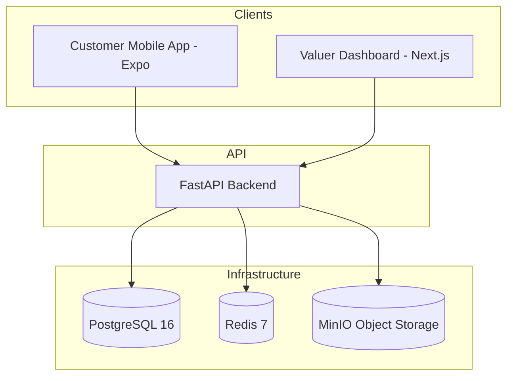

# System Overview

## High-Level Architecture

PropFlow follows a monorepo architecture with a clear separation between the backend API and frontend applications.

## Core Components

- **Backend**: Python FastAPI serving REST and WebSocket endpoints.
- **Customer App**: Expo-based React Native app for property data collection.
- **Valuer Dashboard**: Next.js application for property review and valuation.
- **Shared UI**: (Future) Shared component library and logic.
